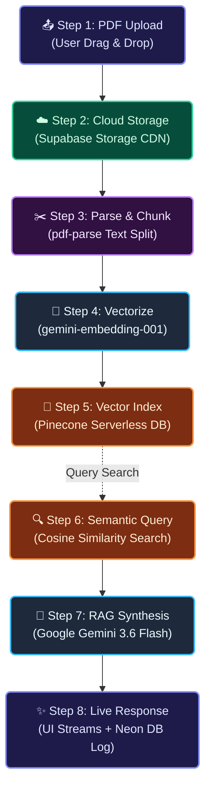

# 🤖 ChatPDF AI Studio

> An enterprise-grade AI-powered document analysis system built with **Google Gemini**, **RAG (Retrieval-Augmented Generation)**, and a beautiful **resizable 3-panel workspace**.

Upload any PDF and instantly chat with it — ask questions, extract data, and get accurate answers with page citations powered by Google Gemini 3.6 Flash.

---

## ✨ Features

- **📄 PDF Upload & Preview** — Drag & drop any PDF; view it live alongside your conversation
- **🤖 Gemini-Powered RAG** — Uses Google Gemini 3.6 Flash for intelligent, context-aware responses
- **📌 Page Citations** — Every AI answer references the exact page in your document
- **🧠 Vector Semantic Search** — Pinecone vector DB retrieves the most relevant chunks for each query
- **💬 Multi-Document Chat** — Upload multiple PDFs and switch between them from the sidebar
- **↔️ Resizable 3-Panel Workspace** — Drag handles to freely resize Sidebar, PDF Preview, and AI Chat Studio
- **🌙 Premium Dark UI** — Glassmorphism-inspired dark design with smooth micro-animations
- **☁️ Cloud PDF Storage** — PDFs stored in Supabase Storage; embeddings in Pinecone

## 🏗️ Architecture



### 🗓️ The 8-Step System Pipeline

| Step | Phase | Process Flow |
| :--- | :--- | :--- |
| **01** | **PDF Upload** | User drops a document into the upload zone; Next.js routes it to `/api/create-chat`. |
| **02** | **Cloud Storage** | The raw PDF is stored securely on **Supabase Storage** and its link is logged in **Neon DB**. |
| **03** | **Text Extraction** | `pdf-parse` extracts raw text, which is parsed into overlapping 1000-character context blocks. |
| **04** | **Semantic Embedding** | Chunks are sent to **Google Gemini (`gemini-embedding-001`)** to produce 768-dimension vectors. |
| **05** | **Vector DB Seeding** | Embeddings are loaded into a namespaced index in **Pinecone Vector Database** for instant matching. |
| **06** | **Semantic Retrieval** | When a query arrives, it is embedded and matched against Pinecone to locate the top 5 relevant text segments. |
| **07** | **Context Synthesis** | The matching text segments, chat history, and system instructions are compiled and fed to **Gemini 3.6 Flash**. |
| **08** | **Response & Log** | The generated response streams back to the user interface and is simultaneously logged to **Neon PostgreSQL**. |

---

## 🧰 Tech Stack

| Layer | Technology |
|---|---|
| **Frontend Framework** | Next.js 14 (App Router) |
| **UI Styling** | Tailwind CSS + Custom dark theme |
| **AI / LLM** | Google Gemini 3.6 Flash |
| **Embeddings** | Google gemini-embedding-001 (768-dim) |
| **Vector Database** | Pinecone (serverless) |
| **Relational Database** | Neon PostgreSQL (serverless) |
| **ORM** | Drizzle ORM |
| **PDF Storage** | Supabase Storage |
| **PDF Parsing** | pdf-parse |
| **Icons** | Lucide React |

---

## 📁 Project Structure

```
src/
├── app/
│   ├── page.tsx                   # Landing page — Upload PDF
│   ├── layout.tsx                 # Root layout
│   ├── chat/[chatId]/page.tsx     # Chat workspace (3-panel resizable)
│   └── api/
│       ├── create-chat/route.ts   # PDF upload → parse → embed → store
│       ├── chat/route.ts          # RAG pipeline → Gemini → stream
│       ├── get-messages/route.ts  # Fetch chat history from DB
│       └── upload-local/route.ts  # Local PDF upload handler
├── components/
│   ├── ChatComponent.tsx          # AI chat input + streaming messages
│   ├── ChatSideBar.tsx            # All chats list + New Chat modal
│   ├── MessageList.tsx            # Formatted markdown message renderer
│   ├── PDFViewer.tsx              # Native iframe PDF preview
│   ├── FileUpload.tsx             # Drag-and-drop PDF uploader
│   └── ResizableWorkspace.tsx     # Drag-handle resizable 3-panel layout
└── lib/
    ├── db/
    │   ├── index.ts               # Drizzle DB connection
    │   └── schema.ts              # chats + messages tables
    ├── embeddings.ts              # Google Gemini embedding logic
    ├── context.ts                 # Pinecone semantic search / RAG context
    ├── pinecone.ts                # Pinecone client init
    ├── supabase-storage.ts        # Supabase PDF upload helper
    └── subscription.ts            # Subscription / Pro check
```

---

## 🚀 Getting Started

### 1. Clone the repo
```bash
git clone https://github.com/TejasAradhya7/chatpdf.git
cd chatpdf
npm install
```

### 2. Set up environment variables
Create a `.env` file in the root:
```env
# Database (Neon PostgreSQL)
DATABASE_URL=your_neon_database_url

# Google Gemini AI
GOOGLE_GENERATIVE_AI_API_KEY=your_gemini_api_key

# Pinecone Vector DB
PINECONE_API_KEY=your_pinecone_api_key
PINECONE_INDEX_NAME=chatpdf

# Supabase Storage
NEXT_PUBLIC_SUPABASE_URL=your_supabase_url
NEXT_PUBLIC_SUPABASE_ANON_KEY=your_supabase_anon_key
SUPABASE_SERVICE_ROLE_KEY=your_service_role_key
```

### 3. Run DB migrations
```bash
npx drizzle-kit push:pg
```

### 4. Create Pinecone index
```bash
node create-index.js
```

### 5. Start the dev server
```bash
npm run dev
```

Visit **http://localhost:3000** and upload your first PDF!

---

## 📸 Workspace Layout

```
┌──────────────┬──────────────────────────┬────────────────────────┐
│              │                          │                        │
│   Sidebar    │     PDF Document         │   AI Chat Studio       │
│              │      Preview             │                        │
│  • Chat 1    │  ┌────────────────────┐  │  You: What is this?   │
│  • Chat 2    │  │                    │  │                        │
│  • Chat 3    │  │  [PDF renders      │  │  AI: This document    │
│              │  │   here natively]   │  │  discusses... 🏷️ P.3  │
│  + New Chat  │  │                    │  │                        │
│              │  └────────────────────┘  │  [Type a question...] │
│              │                          │                        │
└──────────────┴──────────────────────────┴────────────────────────┘
  ↕ Drag handle           ↕ Drag handle
  (resize sidebar)        (resize chat panel)
```

---

## 📄 License

MIT © Tejas Aradhya
